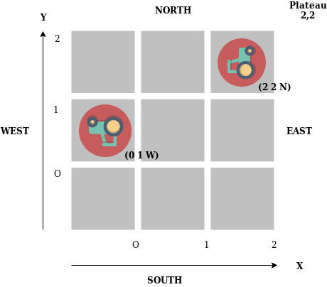

# MarsRover-python
MarsRover is a programming exercise aimed to put in practice different principles and techniques,e.g.,OOP, TDD, Domain Driven Design, etc. 
Here a possible solution in Python is presented.

## MarsRover Problem Statement 
*Original problem statement from https://github.com/priyaaank/MarsRover*

A squad of robotic rovers are to be landed by NASA on a plateau on Mars. This plateau, which is curiously rectangular, must be navigated by the rovers so that their on-board cameras can get a complete view of the surrounding terrain to send back to Earth. 

A rover's position and location is represented by a combination of x and y co-ordinates and a letter representing one of the four cardinal compass points. The plateau is divided up into a grid to simplify navigation. An example position might be 0, 0, N, which means the rover is in the bottom left corner and facing North. 



Sample rovers positioned at a 2x2 Plateau

In order to control a rover, NASA sends a simple string of letters. The possible letters are ```'L', 'R' and 'M'```. 'L' and 'R' makes the rover spin 90 degrees left or right respectively, without moving from its current spot. 'M' means move forward one grid point, and maintain the same heading.

Assume that the square directly North from (x, y) is (x, y+1).

**INPUT**

The first line of input is the upper-right coordinates of the plateau, the lower-left coordinates are assumed to be 0,0.

The rest of the input is information pertaining to the rovers that have been deployed. Each rover has two lines of input. The first line gives the rover's position, and the second line is a series of instructions telling the rover how to explore the plateau. The position is made up of two integers and a letter separated by spaces, corresponding to the x and y co-ordinates and the rover's orientation.

Each rover will be finished sequentially, which means that the second rover won't start to move until the first one has finished moving.

**OUTPUT**

The output for each rover should be its final co-ordinates and heading.

Test Input:
```
5 5

1 2 N

LMLMLMLMM

3 3 E

MMRMMRMRRM
```
Expected Output:
```
1 3 N

5 1 E
```
## Installing

Requirements : Python3, pip

It is recommended to use virtualenv:
```
virtualenv /path/to/ENV/
source /path/to/ENV/bin/activate
```
Installing MarsRover
```
   git clone https://github.com/codergolem/marsRover-python
   cd MarsRover
   pip3 install . 
```
## How to use:
###  Running the test input
```
   python3 run.py
```
This will take the test input from ```inputFile.txt``` and print the Rover(s) final position(s) to stdout.
    
### Modifying the input
By editing ```inputFile.txt```  and running ```run.py``` again you can test different set of instructions 
## Running the tests
```
python3 -m pytest
```

## License
Copyright (c) 2014 Priyank Gupta

Copyright (c) 2019 Mario Castellanos

Permission is hereby granted, free of charge, to any person obtaining a copy of this software and associated documentation files (the "Software"), to deal in the Software without restriction, including without limitation the rights to use, copy, modify, merge, publish, distribute, sublicense, and/or sell copies of the Software, and to permit persons to whom the Software is furnished to do so, subject to the following conditions:

The above copyright notice and this permission notice shall be included in all copies or substantial portions of the Software.

THE SOFTWARE IS PROVIDED "AS IS", WITHOUT WARRANTY OF ANY KIND, EXPRESS OR IMPLIED, INCLUDING BUT NOT LIMITED TO THE WARRANTIES OF MERCHANTABILITY, FITNESS FOR A PARTICULAR PURPOSE AND NONINFRINGEMENT. IN NO EVENT SHALL THE AUTHORS OR COPYRIGHT HOLDERS BE LIABLE FOR ANY CLAIM, DAMAGES OR OTHER LIABILITY, WHETHER IN AN ACTION OF CONTRACT, TORT OR OTHERWISE, ARISING FROM, OUT OF OR IN CONNECTION WITH THE SOFTWARE OR THE USE OR OTHER DEALINGS IN THE SOFTWARE.